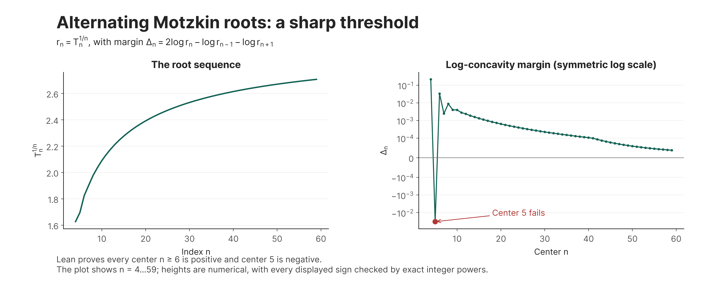

# Sharp log-concavity of alternating Motzkin roots

For the Motzkin numbers Mₙ, let Tₙ = Mₙ − Mₙ₋₁ + ⋯ + (−1)ⁿM₀ and rₙ = Tₙ^(1/n).
We prove **rₙ₋₁ rₙ₊₁ < rₙ² for every n ≥ 6**, with the strict reverse at n = 5. Thus the starting index 5 is sharp.

This implies [Zhao's Conjecture 1, Integers 26 (2026), A55](https://math.colgate.edu/~integers/aa55/aa55.pdf), which asks for the weaker non-strict conclusion starting at index 9. The final Lean theorem uses the actual alternating sum, via `T_eq_alternating_sum`; its only hypothesis is the index bound.

A bounded primary-source review on September 5, 2026 found no earlier proof of this exact result. The ratio-bound/root-inequality method has substantial prior art, including [Hou–Li](https://arxiv.org/abs/2310.19234); historical priority is unverified. The concrete use is a proved shape constraint for the root sequence of this enumerative sequence.
[Proof](proof.md) · [Lean sources](Research/) · [Build and audit](REPRODUCE.md) · [Executable example](example.py)

The plot is numerical; each of the 56 displayed margin signs is checked by exact integer powers before rendering. The universal conclusion comes from Lean. [Exact sequence values and plotted data](plot-data.csv) · [SVG](example-plot.svg) · [PDF](example-plot.pdf).

The figure uses Inter throughout and is available as a 600-dpi PNG and vector
SVG/PDF. To regenerate: keep the full repository checkout, install
`requirements-plot.txt`, and run `python3 plot.py`. The script uses
[the shared style](../plot_style.py) and [bundled fonts](../assets/fonts/inter/README.md);
no system font installation is required.
